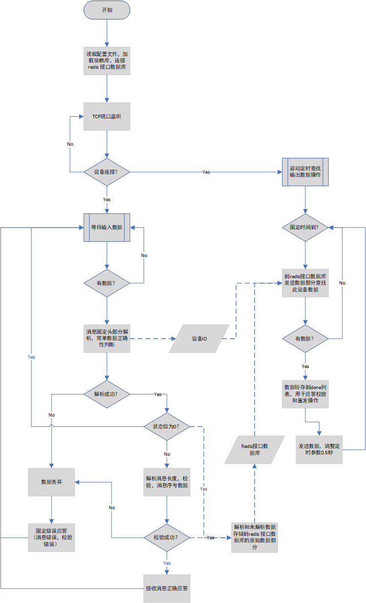

# TCP 方式接入服务器

### 服务器进行消息接收、发送和存储，接收错误应答和正确应答，指令数据库里不再存储接收应答

---

**1. 运行流程**

a. 消息接收

- 初始化，读取配置
- 连接 redis
- 监听端口
- 设备连接，获取消息
- 固定消息头解析
- 状态不为 0 时校验消息
- 数据存储到 redis 原始数据库
- 消息应答

b. 指令发送

- 固定时间间隔监测 redis 指令数据库
- 获取到发送数据，输出转存到 done
- 发送数据，调整定时
- 若有数据则继续重复上条操作，若无数据，恢复固定时间间隔

---

**2. 流程图**

